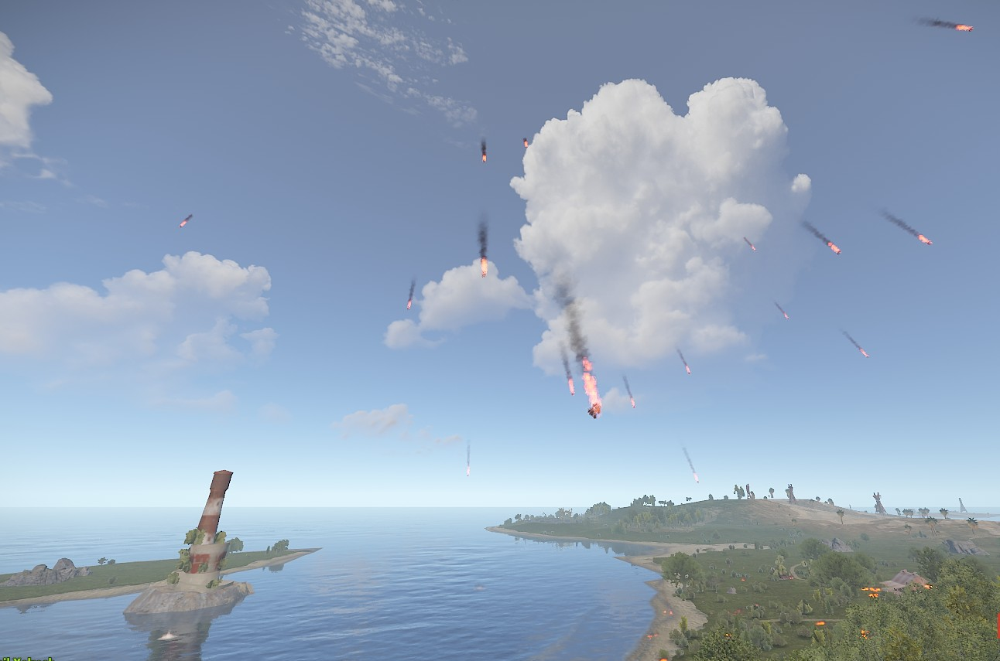
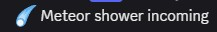

# CelestialBarrage

[](https://rust.facepunch.com/)
[](https://umod.org/)
[](https://github.com/FtuoilXelrash/CelestialBarrage/releases)
[](LICENSE)
[](https://github.com/FtuoilXelrash/CelestialBarrage/releases)

Transform your Rust server with **spectacular meteor shower events** that rain down rockets from the sky! CelestialBarrage brings dynamic, configurable celestial events with three intensity levels, automatic scheduling, and rewarding loot drops that will keep your players engaged and coming back for more.

<div align="center">
  
  
  <br>
  <em>Epic meteor showers with explosive visuals and valuable loot drops</em>
</div>

## ✨ Key Features

- ☄️ **Dynamic Meteor Events** - Automatic scheduling with configurable random or fixed timers
- 🎯 **Three Intensity Levels** - Mild (beginner), Medium (balanced), Extreme (hardcore)
- 💥 **Advanced Rocket System** - Fire rockets, realistic physics, smart spread patterns
- 💎 **Rewarding Loot System** - Tiered rewards with stones, metal ore, fragments, and more
- 🔧 **Real-time Configuration** - Change settings without server restart
- 🌍 **Smart Map Integration** - Respects boundaries, terrain detection, safe zones
- 🛡️ **Performance Optimized** - Minimal server impact with automatic cleanup
- 🔗 **Discord Integration** - Works with Discord webhooks

## 🚀 Quick Installation

1. **Download** the [latest release](https://github.com/FtuoilXelrash/CelestialBarrage/releases)
2. **Copy** `CelestialBarrage.cs` to your `oxide/plugins/` directory
3. **Restart** your server - config auto-generates at `oxide/config/CelestialBarrage.json`
4. **Configure** your settings and reload the plugin

> 💡 **Pro Tip:** The plugin works out-of-the-box with default settings optimized for most servers!

## 📋 Requirements

- 🖥️ **Rust Dedicated Server**
- 🔧 **[Umod (Oxide)](https://umod.org/)** framework
- 💬 **Optional:** [rServerMessages](https://github.com/FtuoilXelrash/rServerMessages) for Discord integration

## 🎮 Commands & Usage

### Admin Commands (Chat)

| Command | Description | Example |
|---------|-------------|---------|
| `/cb` | Show help menu | `/cb` |
| `/cb onplayer` | Start optimal event on your position | `/cb onplayer` |
| `/cb onplayer <player>` | Start optimal event on target player | `/cb onplayer PlayerName` |
| `/cb random` | Start random map event | `/cb random` |
| `/cb barrage` | Fire rocket barrage from your position | `/cb barrage` |

### Intensity Variants

| Command | Rockets | Duration | Radius | Best For |
|---------|---------|----------|--------|----------|
| `/cb onplayer_mild` | 20 | 240s | 500m | New players, learning |
| `/cb onplayer_medium` | 45 | 120s | 300m | Balanced gameplay |
| `/cb onplayer_extreme` | 70 | 30s | 100m | Hardcore, high risk/reward |

### Console Commands

```bash
cb.random                    # Start random meteor event
cb.onposition <x> <z>        # Start event at coordinates
```

## ⚙️ Configuration

The plugin creates `oxide/config/CelestialBarrage.json` with these key settings:

### 🔧 Global Options
```json
{
  "Options": {
    "EnableAutomaticEvents": true,
    "EventTimers": {
      "EventInterval": 30,
      "UseRandomTimer": false,
      "RandomTimerMin": 15,
      "RandomTimerMax": 45
    },
    "GlobalDropMultiplier": 1.0,
    "NotifyEvent": true
  }
}
```

### 🎯 Intensity Settings

#### Mild Settings (Beginner Friendly)
- **Fire Rocket Chance:** 30%
- **Radius:** 500m
- **Duration:** 240 seconds
- **Rockets:** 20
- **Drops:** Stones (80-120), Metal Ore (25-50)

#### Medium Settings (Balanced)
- **Fire Rocket Chance:** 20%
- **Radius:** 300m
- **Duration:** 120 seconds
- **Rockets:** 45
- **Drops:** Stones (160-250), Metal Fragments (60-120), HQ Metal Ore (20-50)

#### Extreme Settings (Hardcore)
- **Fire Rocket Chance:** 10%
- **Radius:** 100m
- **Duration:** 30 seconds
- **Rockets:** 70
- **Drops:** Stones (250-400), Metal Fragments (125-300), Refined Metal (20-50), Sulfur Ore (45-120)

### 🎯 Barrage Settings
```json
{
  "BarrageSettings": {
    "NumberOfRockets": 20,
    "RocketDelay": 0.33,
    "RocketSpread": 16.0
  }
}
```

## 🔥 Event Types

### 🔄 Automatic Events
- **Fixed Intervals:** Consistent timing (default: 30 minutes)
- **Random Timers:** Unpredictable events (15-45 minute range)
- **Map-wide Coverage:** Events spawn across the entire map

### 🎯 Manual Events
- **Player Targeting:** Target specific players by name
- **Position-based:** Target exact coordinates
- **Admin-initiated:** Instant event creation with real-time adjustments

### 💥 Barrage Mode
- **Concentrated Attack:** 20 rockets in rapid succession
- **Directional Fire:** Rockets fire forward from admin position
- **Customizable Spread:** 16-degree pattern by default

## 🛡️ Performance & Balance

### ⚡ Optimizations
- **CPU Usage:** < 1% during events
- **Memory:** 2-5 MB during active events
- **Smart Cleanup:** Automatic entity removal
- **Lag Prevention:** Controlled rocket intervals

### ⚖️ Balance Features
- **Damage Scaling:** Global multiplier (default: 0.2x)
- **Map Boundaries:** 600m buffer from edges
- **Safe Zones:** Respects terrain and water levels
- **Performance Tuning:** Configurable for different server sizes

### 🎛️ Server Recommendations

**High Population (100+ players):**
```json
{
  "DamageControl": { "DamageMultiplier": 0.1 },
  "BarrageSettings": { "RocketDelay": 0.5 }
}
```

**Low Population (< 50 players):**
```json
{
  "DamageControl": { "DamageMultiplier": 0.3 },
  "BarrageSettings": { "RocketDelay": 0.25 }
}
```

## 🔗 Plugin Integration

### 💬 Discord Integration (rServerMessages)
Supports automatic Discord announcements:
- Event start notifications
- Configurable message keywords

### 🔧 Plugin Development Hook

CelestialBarrage provides a hook for other plugin developers:

**`OnCelestialBarrageImpact`**
```csharp
void OnCelestialBarrageImpact(BaseCombatEntity entity, HitInfo info, string entityType, string ownerInfo)
```

**Parameters:**
- `entity` - The entity that was hit by the meteor
- `info` - HitInfo containing damage and impact details
- `entityType` - Type of entity hit ("Player", structure name, etc.)
- `ownerInfo` - Player name or owner information

**Example Usage:**
```csharp
void OnCelestialBarrageImpact(BaseCombatEntity entity, HitInfo info, string entityType, string ownerInfo)
{
    if (entityType == "Player")
    {
        Puts($"Player {ownerInfo} was hit by a meteor for {info.damageTypes.Total()} damage!");
        // Add custom effects, notifications, or logging
    }
    else if (entity.OwnerID != 0)
    {
        Puts($"Structure {entityType} owned by {ownerInfo} was hit by a meteor!");
        // Handle structure impacts
    }
}
```

## 🐛 Troubleshooting

### Common Issues

**Events Not Starting**
- ✅ Verify `"EnableAutomaticEvents": true`
- ✅ Check console for timer messages
- ✅ Ensure minimum 4-minute intervals

**No Rockets Spawning**
- ✅ Check damage multiplier settings
- ✅ Verify map boundaries
- ✅ Confirm rocket amount > 0

**Items Not Dropping**
- ✅ Verify `"EnableItemDrop": true`
- ✅ Check global drop multiplier
- ✅ Ensure valid item shornames

**Performance Issues**
- ✅ Reduce rocket amounts
- ✅ Increase rocket delays
- ✅ Lower damage multiplier

## 📞 Support & Community

- 🐛 **[Report Issues](https://github.com/FtuoilXelrash/CelestialBarrage/issues)** - Bug reports and feature requests
- 💬 **[Discord Support](https://discord.gg/G8mfZH2TMp)** - Join our community for help and discussions
- 📖 **[Umod Page](https://umod.org/plugins/celestial-barrage)** - Official plugin listing
- 📥 **[Download Latest](https://github.com/FtuoilXelrash/CelestialBarrage/releases)** - Always get the newest version

## 🤝 Contributing

We welcome contributions! To get started:

1. Fork the repository
2. Create a feature branch (`git checkout -b feature/amazing-feature`)
3. Follow [Umod coding standards](https://umod.org/documentation/api/approval-guide)
4. Test thoroughly with all intensity levels
5. Submit a pull request with detailed description

## 📄 License

This project is licensed under the **MIT License** - see the [LICENSE](LICENSE) file for details.

## 👨‍💻 Author

**Ftuoil Xelrash**
- 🐙 GitHub: [@FtuoilXelrash](https://github.com/FtuoilXelrash)
- 💬 Discord: [Plugin Support Server](https://discord.gg/G8mfZH2TMp)

---

⭐ **Star this repository if CelestialBarrage enhances your Rust server!** ⭐