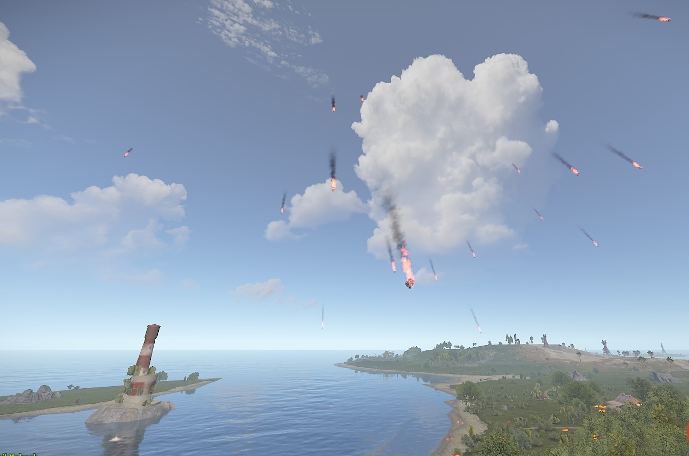

# Celestial Barrage

[](https://rust.facepunch.com/)
[](https://umod.org/)
[](https://github.com/FtuoilXelrash/CelestialBarrage/releases)
[](LICENSE)
[](https://github.com/FtuoilXelrash/CelestialBarrage/releases)


Transform your Rust server with **spectacular meteor shower events** that rain down rockets from the sky! Celestial Barrage brings dynamic, configurable celestial events with three intensity levels, automatic scheduling, and rewarding loot drops that will keep your players engaged and coming back for more.

<div align="center">
  
  <br>
  <em>Epic meteor showers with explosive visuals and valuable loot drops</em>
</div>

## ✨ Key Features

- ☄️ **Dynamic Meteor Events** - Automatic scheduling with configurable random or fixed timers
- 🎯 **Three Intensity Levels** - Mild (beginner), Medium (balanced), Extreme (hardcore)
- 💥 **Advanced Rocket System** - Fire rockets, realistic physics, smart spread patterns
- 💎 **Rewarding Loot System** - Tiered rewards with stones, metal ore, fragments, and more
- 🔧 **Real-time Configuration** - Change settings without server restart
- 🌍 **Smart Map Integration** - Respects boundaries, terrain detection, safe zones
- 🛡️ **Performance Optimized** - Minimal server impact with automatic cleanup
- 🔗 **Discord Integration** - Works with Discord webhooks

## 🚀 Quick Installation

1. **Download** the [latest release](https://github.com/FtuoilXelrash/CelestialBarrage/releases)
2. **Copy** `CelestialBarrage.cs` to your `oxide/plugins/` directory
3. **Restart** your server - config auto-generates at `oxide/config/CelestialBarrage.json`
4. **Configure** your settings and reload the plugin

> 💡 **Pro Tip:** The plugin works out-of-the-box with default settings optimized for most servers!

## 📋 Requirements

- 🖥️ **Rust Dedicated Server**
- 🔧 **[Umod (Oxide)](https://umod.org/)** framework

## 🎮 Commands & Usage

### Admin Commands (Chat)

| Command | Description | Example |
|---------|-------------|---------|
| `/cb` | Show help menu | `/cb` |
| `/cb onplayer` | Start optimal event on your position | `/cb onplayer` |
| `/cb onplayer <player>` | Start optimal event on target player | `/cb onplayer PlayerName` |
| `/cb random` | Start random map event | `/cb random` |
| `/cb barrage` | Fire rocket barrage from your position | `/cb barrage` |

### Intensity Variants

| Command | Rockets | Duration | Radius | Best For |
|---------|---------|----------|--------|----------|
| `/cb onplayer_mild` | 10-25 | 3m-5m | 500m | New players, learning |
| `/cb onplayer_medium` | 30-60 | 4m-8m | 300m | Balanced gameplay |
| `/cb onplayer_extreme` | 55-90 | 5m-10m | 100m | Hardcore, high risk/reward |

### Console Commands

```bash
cb.random                    # Start random meteor event
cb.onposition <x> <z>        # Start event at coordinates
```

## ⚙️ Configuration

The plugin creates `oxide/config/CelestialBarrage.json` with comprehensive configuration options. Existing settings are always preserved when the plugin updates — any new properties added in a future version will appear with their defaults without touching your customizations. Below is a complete reference of every available setting:

### 🔧 Global Event Options

**Core Event Settings:**
```json
{
  "Options": {
    "EnableAutomaticEvents": true,
    "MinimumPlayerCount": 1,
    "InGamePlayerEventNotifications": true,
    "EventTimers": {
      "EventIntervalMinutes": 360,
      "UseRandomTimers": true
    }
  }
}
```

**Option Descriptions:**
- **EnableAutomaticEvents** (bool): Enables/disables automatic meteor events. When `false`, only manual commands work
- **MinimumPlayerCount** (int): Minimum number of players required online for events to trigger (default: 1)
- **InGamePlayerEventNotifications** (bool): When enabled, sends colored chat notifications to all players when events start/end
- **EventTimers**:
  - **EventIntervalMinutes** (int): Minutes between automatic events (default: 360 minutes / 6 hours)
  - **UseRandomTimers** (bool): When `true`, each event's duration and rocket count are randomly chosen from the configured min/max ranges for that intensity type

### ⚡ Performance Monitoring

Monitor server performance and prevent events during lag:

```json
{
  "Options": {
    "PerformanceMonitoring": {
      "EnableFPSCheck": true,
      "MinimumFPS": 40.0
    }
  }
}
```

**Settings:**
- **EnableFPSCheck** (bool): When `true`, the plugin checks server FPS before starting events. Admin manual events always bypass this check — it only applies to automatic timer events
- **MinimumFPS** (float): Minimum acceptable FPS to allow automatic events. Events are cancelled if server FPS falls below this (default: 40.0)

### 🎨 Visual Effects

Control visual effects during events:

```json
{
  "Options": {
    "VisualEffects": {
      "EnableScreenShake": true,
      "EnableParticleTrails": true,
      "ShowEventMapMarkers": true
    }
  }
}
```

**Settings:**
- **EnableScreenShake** (bool): When `true`, rockets create screen shake effects for nearby players
- **EnableParticleTrails** (bool): When `true`, rockets display particle effect trails as they fall
- **ShowEventMapMarkers** (bool): When `true`, map markers appear at meteor event locations to help players locate the action

### 🔊 Logging Options

Control debug console logging:

```json
{
  "Logging": {
    "LogDebugToConsole": false
  }
}
```

**Settings:**
- **LogDebugToConsole** (bool): When `true`, plugin logs detailed debug information to server console (default: false)

### 🌐 Public Discord Channel

Configure public Discord notifications (visible to entire server):

```json
{
  "Logging": {
    "PublicChannel": {
      "Enabled": false,
      "Webhook URL": "https://discord.com/api/webhooks/YOUR_WEBHOOK_ID/YOUR_WEBHOOK_TOKEN"
    }
  }
}
```

**Settings:**
- **Enabled** (bool): Enable/disable public channel Discord notifications (when enabled, sends all event start/end messages to Discord)
- **Webhook URL** (string): Discord webhook URL for public notifications (get from Discord channel settings)

### 🔐 Admin Discord Channel

Configure private Discord notifications (visible only to admins):

```json
{
  "Logging": {
    "AdminChannel": {
      "Enabled?": false,
      "Include Event Messages?": false,
      "Include Impact Messages?": true,
      "Webhook URL": "https://discord.com/api/webhooks/YOUR_ADMIN_WEBHOOK_ID/YOUR_ADMIN_WEBHOOK_TOKEN",
      "Impact Filtering": {
        "Log Player Impacts?": true,
        "Log Structure Impacts?": true,
        "Minimum Impact Damage Threshold": 50.0
      }
    }
  }
}
```

**Admin Channel Settings:**
- **Enabled?** (bool): Enable/disable admin channel Discord notifications
- **Include Event Messages?** (bool): When `true`, sends event start/end messages to admin channel
- **Include Impact Messages?** (bool): When `true`, sends meteor impact details (players, structures) to admin channel
- **Webhook URL** (string): Discord webhook URL for admin notifications

**Impact Filtering Settings:**
- **Log Player Impacts?** (bool): When `true`, logs when meteors hit players to Discord
- **Log Structure Impacts?** (bool): When `true`, logs when meteors hit structures/bases to Discord
- **Minimum Impact Damage Threshold** (float): Only logs impacts with damage of this amount or higher (default: 50.0). Prevents Discord spam from low-damage hits (includes filtering of smoke rockets which do 0 damage)

### 🎯 Discord Rate Limiting

Prevent Discord API spam and rate limits:

```json
{
  "Logging": {
    "DiscordRateLimit": {
      "EnableRateLimit": true,
      "ImpactMessageCooldown": 1.0,
      "MaxImpactsPerMinute": 15
    }
  }
}
```

**Settings:**
- **EnableRateLimit** (bool): When `true`, enforces rate limiting to avoid Discord API throttling
- **ImpactMessageCooldown** (float): Minimum seconds between impact messages (default: 1.0, higher = less spam)
- **MaxImpactsPerMinute** (int): Maximum impact messages sent to Discord per minute (default: 15). Discord has a per-channel webhook limit of 30 messages/minute. Setting this to 15 provides a 15 message safety buffer for other webhooks/bots posting to the same channel, preventing rate limit errors

### 🎯 Barrage Settings

Control the `/cb barrage` command behavior:

```json
{
  "BarrageSettings": {
    "NumberOfRockets": 20,
    "RocketDelay": 0.33,
    "RocketSpread": 16.0
  }
}
```

**Settings:**
- **NumberOfRockets** (int): How many rockets fire during barrage mode (default: 20)
- **RocketDelay** (float): Delay in seconds between each rocket (default: 0.33 = ~3 rockets per second)
- **RocketSpread** (float): Spread angle in degrees for rocket pattern (default: 16.0)

### 🌊 Intensity Settings

Each intensity level is fully customizable with its own damage multiplier.

**Global Settings:**
```json
{
  "IntensitySettings": {
    "ItemDropMultiplier": 1.0,
    "Mild": { ... },
    "Medium": { ... },
    "Extreme": { ... },
    "Spawn Weights": {
      "Mild Spawn Weight": 80.0,
      "Medium Spawn Weight": 40.0,
      "Extreme Spawn Weight": 10.0
    }
  }
}
```
- **ItemDropMultiplier** (float): Global multiplier for all item drop quantities across all intensity levels (default: 1.0 = 100%). Scales the min/max ranges for all dropped items. Use 0.5 for 50% drops, 2.0 for double drops, etc.
- **Spawn Weights**: Controls relative probability of each intensity type being selected for automatic events. Higher value = chosen more often. Values are relative to each other, not fixed percentages. At defaults (80/40/10), approximate odds are Mild ~62%, Medium ~31%, Extreme ~8%
  - **Mild Spawn Weight** (float): Relative weight for Mild events (default: 80)
  - **Medium Spawn Weight** (float): Relative weight for Medium events (default: 40)
  - **Extreme Spawn Weight** (float): Relative weight for Extreme events (default: 10)

Below are the default configurations for each intensity level:

#### Mild Settings (Beginner Friendly)
```json
{
  "Mild": {
    "DamageMultiplier": 0.25,
    "FireRocketChance": 30,
    "Radius": 500.0,
    "RocketAmountMin": 10,
    "RocketAmountMax": 25,
    "DurationSecondsMin": 180,
    "DurationSecondsMax": 300,
    "ItemDropControl": {
      "EnableItemDrop": true,
      "ItemsToDrop": [
        { "Shortname": "stones", "Minimum": 250, "Maximum": 500 },
        { "Shortname": "metal.ore", "Minimum": 250, "Maximum": 500 },
        { "Shortname": "sulfur.ore", "Minimum": 250, "Maximum": 500 },
        { "Shortname": "scrap", "Minimum": 10, "Maximum": 20 }
      ]
    }
  }
}
```

**Characteristics:**
- 10-25 rockets over 3m-5m (randomly chosen each event)
- 500m event radius
- Fire rockets with 30% chance
- Beginner-friendly rewards with stones, ore, and scrap

#### Medium Settings (Balanced)
```json
{
  "Medium": {
    "DamageMultiplier": 0.5,
    "FireRocketChance": 20,
    "Radius": 300.0,
    "RocketAmountMin": 30,
    "RocketAmountMax": 60,
    "DurationSecondsMin": 240,
    "DurationSecondsMax": 480,
    "ItemDropControl": {
      "EnableItemDrop": true,
      "ItemsToDrop": [
        { "Shortname": "stones", "Minimum": 160, "Maximum": 250 },
        { "Shortname": "metal.fragments", "Minimum": 60, "Maximum": 120 },
        { "Shortname": "metal.refined", "Minimum": 20, "Maximum": 50 },
        { "Shortname": "sulfur.ore", "Minimum": 10, "Maximum": 20 }
      ]
    }
  }
}
```

**Characteristics:**
- 30-60 rockets over 4m-8m (randomly chosen each event)
- 300m event radius
- Fire rockets with 20% chance
- Balanced rewards with better loot

#### Extreme Settings (Hardcore)
```json
{
  "Extreme": {
    "DamageMultiplier": 1.0,
    "FireRocketChance": 10,
    "Radius": 100.0,
    "RocketAmountMin": 55,
    "RocketAmountMax": 90,
    "DurationSecondsMin": 300,
    "DurationSecondsMax": 600,
    "ItemDropControl": {
      "EnableItemDrop": true,
      "ItemsToDrop": [
        { "Shortname": "stones", "Minimum": 250, "Maximum": 400 },
        { "Shortname": "metal.fragments", "Minimum": 125, "Maximum": 300 },
        { "Shortname": "metal.refined", "Minimum": 20, "Maximum": 50 },
        { "Shortname": "sulfur.ore", "Minimum": 45, "Maximum": 120 }
      ]
    }
  }
}
```

**Characteristics:**
- 55-90 rockets over 5m-10m (randomly chosen each event, high intensity!)
- 100m event radius (smaller, more concentrated)
- Fire rockets with 10% chance
- Extreme rewards for hardcore players

**Intensity Settings Details:**
- **DamageMultiplier** (float): Damage multiplier for this intensity level (Mild: 0.25, Medium: 0.5, Extreme: 1.0)
- **FireRocketChance** (int): Percentage (0-100) of rockets that will be fire rockets instead of regular damage rockets
- **Radius** (float): Event radius in meters (area of effect)
- **DurationSecondsMin** / **DurationSecondsMax** (float): Duration range in seconds. When `UseRandomTimers: true`, actual duration is randomly chosen between these values each event
- **RocketAmountMin** / **RocketAmountMax** (int): Rocket count range. When `UseRandomTimers: true`, actual rocket count is randomly chosen between these values each event
- **ItemDropControl**:
  - **EnableItemDrop** (bool): When `true`, items drop at meteor impact locations
  - **ItemsToDrop** (array): List of items to drop with min/max quantities
    - **Shortname** (string): Rust item shortname (e.g., "stones", "metal.ore", "scrap")
    - **Minimum** (int): Minimum quantity dropped per impact
    - **Maximum** (int): Maximum quantity dropped per impact

## 🔥 Event Types

### 🔄 Automatic Events
- **Fixed Intervals:** Fires every `EventIntervalMinutes` (default: 360 minutes / 6 hours)
- **Random Duration & Count:** When `UseRandomTimers: true`, each event's duration and rocket count are randomly chosen from the intensity type's configured min/max ranges
- **Map-wide Coverage:** Events spawn across the entire map

### 🎯 Manual Events
- **Player Targeting:** Target specific players by name
- **Position-based:** Target exact coordinates
- **Admin-initiated:** Instant event creation with real-time adjustments

### 💥 Barrage Mode
- **Concentrated Attack:** 20 rockets in rapid succession
- **Directional Fire:** Rockets fire forward from admin position
- **Customizable Spread:** 16-degree pattern by default

## 🛡️ Performance & Balance

### ⚡ Optimizations
- **CPU Usage:** < 1% during events
- **Memory:** 2-5 MB during active events
- **Smart Cleanup:** Automatic entity removal
- **Lag Prevention:** Controlled rocket intervals

### ⚖️ Balance Features
- **Damage Scaling:** Global multiplier (default: 1.0 = 100% full damage)
- **Map Boundaries:** 600m buffer from edges
- **Safe Zones:** Respects terrain and water levels
- **Performance Tuning:** Configurable for different server sizes

### 🎛️ Server Recommendations

**High Population (100+ players):**
```json
{
  "IntensitySettings": { "DamageMultiplier": 0.1 },
  "BarrageSettings": { "RocketDelay": 0.5 }
}
```

**Low Population (< 50 players):**
```json
{
  "IntensitySettings": { "DamageMultiplier": 0.3 },
  "BarrageSettings": { "RocketDelay": 0.25 }
}
```

## 🔗 Plugin Integration

### 💬 Discord Integration
Built-in Discord webhook support:
- Event start/end notifications
- Impact logging with rate limiting
- Configurable public and admin webhooks

### 🔧 Plugin Development Hook

Celestial Barrage provides a hook for other plugin developers:

**`OnCelestialBarrageImpact`**
```csharp
void OnCelestialBarrageImpact(BaseCombatEntity entity, HitInfo info, string entityType, string ownerInfo)
```

**Parameters:**
- `entity` - The entity that was hit by the meteor
- `info` - HitInfo containing damage and impact details
- `entityType` - Type of entity hit ("Player", structure name, etc.)
- `ownerInfo` - Player name or owner information

**Example Usage:**
```csharp
void OnCelestialBarrageImpact(BaseCombatEntity entity, HitInfo info, string entityType, string ownerInfo)
{
    if (entityType == "Player")
    {
        Puts($"Player {ownerInfo} was hit by a meteor for {info.damageTypes.Total()} damage!");
        // Add custom effects, notifications, or logging
    }
    else if (entity.OwnerID != 0)
    {
        Puts($"Structure {entityType} owned by {ownerInfo} was hit by a meteor!");
        // Handle structure impacts
    }
}
```

## 🐛 Troubleshooting

### Common Issues

**Events Not Starting**
- ✅ Verify `"EnableAutomaticEvents": true`
- ✅ Check console for timer messages
- ✅ Ensure minimum 4-minute intervals

**No Rockets Spawning**
- ✅ Check damage multiplier settings
- ✅ Verify map boundaries
- ✅ Confirm RocketAmountMin > 0

**Items Not Dropping**
- ✅ Verify `"EnableItemDrop": true`
- ✅ Check global drop multiplier
- ✅ Ensure valid item shornames

**Performance Issues**
- ✅ Reduce rocket amounts
- ✅ Increase rocket delays
- ✅ Lower damage multiplier

## 📞 Support & Community

- 🐛 **[Report Issues](https://github.com/FtuoilXelrash/CelestialBarrage/issues)** - Bug reports and feature requests
- 💬 **[Discord Support](https://discord.gg/G8mfZH2TMp)** - Join our community for help and discussions
- 📥 **[Download Latest](https://github.com/FtuoilXelrash/CelestialBarrage/releases)** - Always get the newest version

## 🎮 Development & Testing Server

**Darktidia Solo Only** - See CelestialBarrage and other custom plugins in action!
All players are welcome to join our development server where plugins are tested and refined in a live environment.

- **Server:** Darktidia Solo Only | Monthly | 2x | 50% Upkeep | No BP Wipes
- **Find Server:** [View on BattleMetrics](https://www.battlemetrics.com/servers/rust/33277489)

Experience the plugin live, test configurations, and provide feedback in a real gameplay setting.

## 🤝 Contributing

We welcome contributions! To get started:

1. Fork the repository
2. Create a feature branch (`git checkout -b feature/amazing-feature`)
3. Follow [Umod coding standards](https://umod.org/documentation/api/approval-guide)
4. Test thoroughly with all intensity levels
5. Submit a pull request with detailed description

## 📄 License

This project is licensed under the **MIT License** - see the [LICENSE](LICENSE) file for details.

## 🙏 Acknowledgments

Special thanks to the **[Rain of Fire](https://umod.org/plugins/rain-of-fire)** plugin by **k1lly0u**, which served as inspiration and a valuable learning tool during the development of Celestial Barrage. While Celestial Barrage has evolved into its own unique implementation with advanced features like three intensity levels, Discord integration, and sophisticated configuration options, the foundational concept of meteor events was inspired by this original work.

## 👨‍💻 Author

**Ftuoil Xelrash**
- 🐙 GitHub: [@FtuoilXelrash](https://github.com/FtuoilXelrash)
- 💬 Discord: [Plugin Support Server](https://discord.gg/G8mfZH2TMp)

---

⭐ **Star this repository if Celestial Barrage enhances your Rust server!** ⭐
